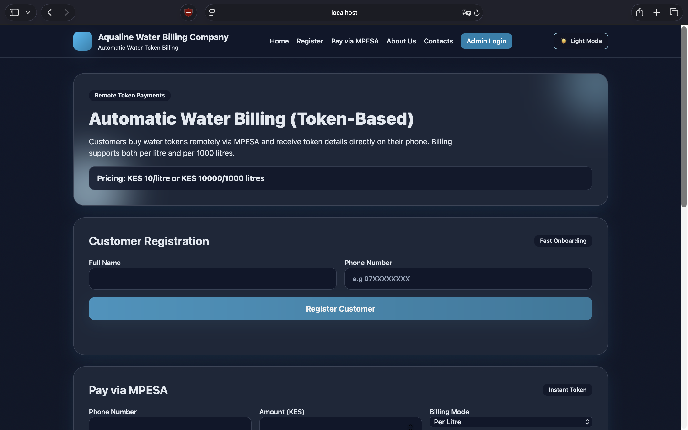
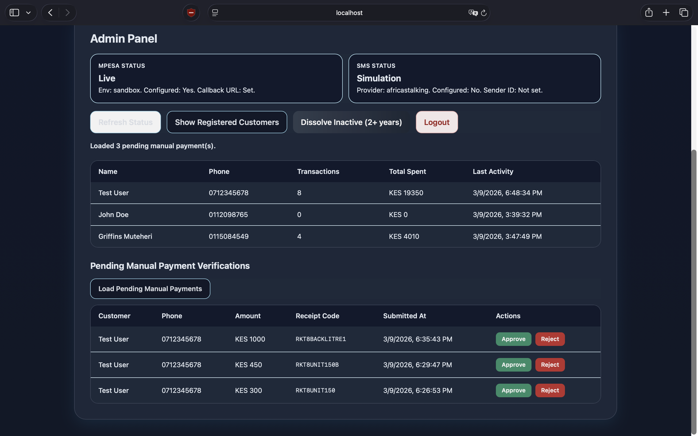
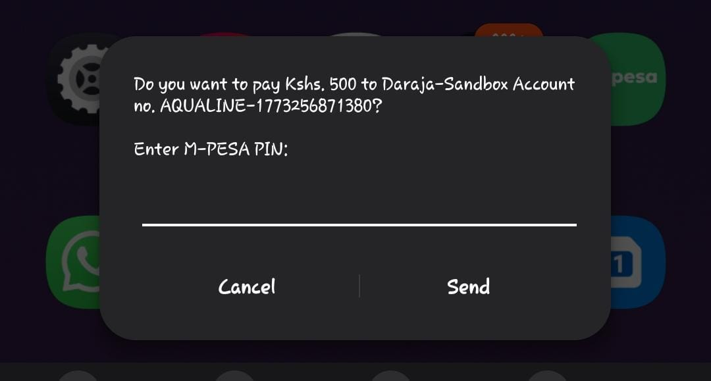

# Aqualine Water Billing Company

Web-based water billing system with customer registration, MPESA payment processing (live or simulated), token generation, SMS notifications, and an admin dashboard.

## Features

- Customer registration and account tracking
- MPESA payment flow:
  - STK push via Daraja (live mode)
  - Simulation mode when credentials are not provided
- Manual payment submission (receipt code) with admin approval/rejection
- Automatic water token generation based on pricing rules
- SMS token delivery:
  - Africa's Talking integration (optional)
  - Simulation mode fallback
- Built-in treasury layer:
  - Auto-settlement per confirmed payment (savings/operations split)
  - Automatic daily settlement sweep for any paid-but-unsettled records
  - Ledger entries for payment, settlement, top-up, and refund movements
  - Operations-float management and manual top-ups from collections
  - Refund tracking with partial/full refund state per payment
  - Maker-checker refund workflow (request + separate approval)
- Admin tools:
  - Customer list and spend/activity summary
  - Pending manual payment review
  - Settlement balances and policy view
  - Unsettled payment settlement trigger
  - Refund issuing and refund history
  - Integration status visibility
  - Inactive account cleanup

## Tech Stack

- Node.js
- Express
- Vanilla JavaScript frontend
- JSON file storage (`data/db.json`)

## Quick Start

### 1) Install dependencies

```bash
npm install
```

### 2) Initialize local database (first run)

```bash
cp data/db.seed.json data/db.json
```

### 3) Start the app

```bash
npm start
```

### 4) Open in browser

- Customer UI: http://localhost:3000
- Admin UI: http://localhost:3000/admin.html

## Screenshots

Place your screenshots in `docs/screenshots/` using the filenames below.

### Homepage



### Admin Page



### MPESA Push Notification Page



## Admin Access

- Default local admin key: `AQUALINE_ADMIN_2026`
- Override with environment variable:

```bash
ADMIN_KEY=your_secure_key npm start
```

Admin APIs require `x-admin-key` header (or `Authorization: Bearer <key>`).

## Environment Configuration

Create a `.env` file in the project root (optional). If values are missing, the app falls back to simulation where supported.

### MPESA (Daraja)

Set these for live MPESA processing:

- `MPESA_ENABLED=true`
- `MPESA_ENV=sandbox` or `MPESA_ENV=live`
- `MPESA_CONSUMER_KEY`
- `MPESA_CONSUMER_SECRET`
- `MPESA_SHORTCODE`
- `MPESA_PASSKEY`
- `MPESA_CALLBACK_URL`
- `MPESA_TILL_NUMBER` (optional, shown in manual payment instructions)

Callback endpoint:

- `/api/payments/mpesa/callback`

### ngrok for Local Development and GitHub Clones

If you are testing MPESA locally, Daraja needs a public HTTPS callback URL. That is where ngrok is used.

Important:

- ngrok is only for local development and testing.
- Do not commit your personal ngrok URL or auth token to GitHub.
- Every developer who clones this repository can use their own ngrok account and their own local `.env` file.

Typical local setup:

```bash
ngrok config add-authtoken YOUR_NGROK_TOKEN
ngrok http 3000
```

Then copy the HTTPS forwarding URL and set:

```env
MPESA_CALLBACK_URL=https://your-ngrok-url/api/payments/mpesa/callback
```

After updating `.env`, restart the app.

If the app is deployed to a real public server, ngrok is no longer needed. Use your deployed HTTPS domain instead.

### SMS (Africa's Talking)

Set these for live SMS sending:

- `SMS_ENABLED=true`
- `SMS_PROVIDER=africastalking`
- `SMS_API_KEY`
- `SMS_USERNAME`
- `SMS_SENDER_ID` (optional)

### Settlement Policy (Internal Buckets)

Optional settings for treasury logic:

- `SETTLEMENT_SAVINGS_PERCENT` (default: `70`)
- `MIN_OPERATIONS_FLOAT` (default: `20000`)
- `AUTO_SETTLEMENT_ENABLED` (default: `true`)
- `AUTO_SETTLEMENT_HOUR_UTC` (default: `1`)
- `APPROVER_KEY` (optional: dedicated key for refund approval)

`operationsPercent` is computed as `100 - savingsPercent`.

### Treasury Flow (Very Simple)

1. Payment becomes `paid`.
2. System splits it immediately:
   - `SETTLEMENT_SAVINGS_PERCENT` goes to `savings`
   - remainder goes to `operations`
3. If a paid record somehow missed settlement, daily auto-sweep settles it at `AUTO_SETTLEMENT_HOUR_UTC`.
4. Refunds are maker-checker:
   - admin creates refund request (`pending_approval`)
   - different approver approves request
   - money is deducted from `operations`

Example with defaults:

- Payment `KES 1,000`
- Savings `70%` -> `KES 700`
- Operations `30%` -> `KES 300`

## Pricing Model

- `KES 10` per litre
- `KES 10,000` per 1000 litres

Litres are calculated using floor division based on selected unit type.

## Core API Endpoints

### Public

- `GET /api/pricing`
- `GET /api/payment-instructions`
- `POST /api/customers/register`
- `POST /api/payments/mpesa`
- `POST /api/payments/manual-submit`
- `POST /api/payments/mpesa/callback`

### Admin (requires admin key)

Auth and status:
- `GET /api/admin/auth-check`
- `GET /api/admin/integration-status`

Customers and payments:
- `GET /api/admin/customers`
- `GET /api/admin/payments`
- `GET /api/admin/payments/recent`
- `GET /api/admin/payments/pending-manual`
- `POST /api/admin/payments/:paymentId/manual-approve`
- `POST /api/admin/payments/:paymentId/manual-reject`

Treasury and settlement:
- `GET /api/admin/finance/overview`
- `GET /api/admin/finance/ledger`
- `POST /api/admin/finance/top-up-operations`
- `POST /api/admin/finance/settle-unsettled-payments`

Refunds (maker-checker):
- `GET /api/admin/refunds`
- `POST /api/admin/refunds` (create request)
- `GET /api/admin/refunds/pending`
- `POST /api/admin/refunds/:refundId/approve` (checker approves)

Maintenance:
- `DELETE /api/admin/customers/inactive?years=2`

## Data Storage

This project uses a local JSON file database:

- `data/db.json`

Tracked seed template:

- `data/db.seed.json`

`data/db.json` is ignored by Git so local/runtime data is not committed.

Best suited for local development and demos.

Additional finance structures:

- `finance` (balances + settlement policy)
- `ledger` (immutable accounting events)
- `settlements` (payment split records)
- `refunds` (issued refund records)

## Notes

- If MPESA or SMS credentials are not configured, related flows automatically run in simulation mode.
- Inactive customer cleanup defaults to accounts inactive for 2+ years.
