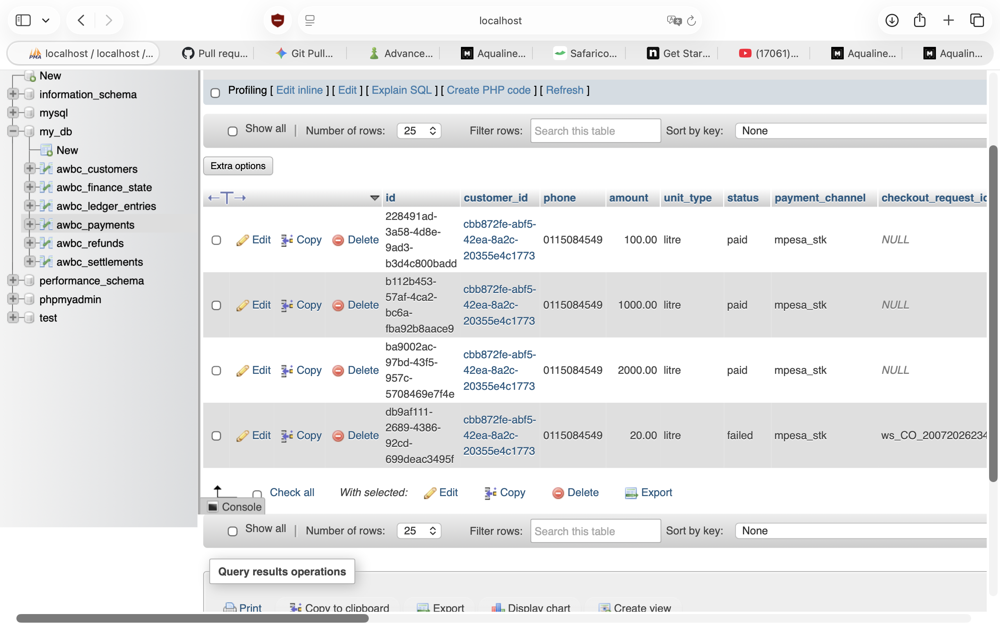

# Aqualine Water Billing System

A web-based water billing system featuring customer registration, Lipa Na M-PESA payment integration (simulated or live STK Push), water token generation, simulated SMS alerts, a ledger audit trail, and an administrative console with a maker-checker refund workflow.

---

## 🚀 Local Setup Instructions

### 1. Prerequisites
Ensure you have the following installed on your machine:
- **Node.js** (v18+) & **npm**

### 2. Installation
Navigate to the project root directory and install dependencies:
```bash
npm install
```

### 3. Initialize Database (JSON or MySQL)
- **Option A: Local JSON File (Default & Fastest)**
  Initialize the local database file from the seed template:
  ```bash
  cp data/db.seed.json data/db.json
  ```
- **Option B: MySQL**
  1. Create a database named `my_db` in your local MySQL instance (or phpMyAdmin).
  2. Import the schema script: [schema/my_db.sql](schema/my_db.sql).
  3. Fill in the MySQL connection parameters (`MYSQL_HOST`, `MYSQL_USER`, `MYSQL_PASSWORD`, `MYSQL_DATABASE`) in your `.env` file.

### 4. Configure Environment
Create a local `.env` file:
```bash
cp .env.example .env
```
Open `.env` and fill in your credentials. If you leave them empty, the application will automatically run in simulation mode.

### 5. Start the Application
Launch the local Express server:
```bash
npm start
```

### 6. Open in Browser
- **Customer Portal**: [http://localhost:3000/customer.html](http://localhost:3000/customer.html)
- **Admin Dashboard**: [http://localhost:3000/admin.html](http://localhost:3000/admin.html) *(Default local admin key: `AQUALINE_ADMIN_2026`)*
- **Public Landing Page**: [http://localhost:3000](http://localhost:3000)

---

## 📲 Testing MPESA STK Push Locally (ngrok)

To receive Lipa Na M-PESA prompts on your physical phone, Daraja needs a public HTTPS callback URL:

1. **Start ngrok tunnel** on port 3000:
   ```bash
   ngrok http 3000
   ```
2. **Update your `.env`**:
   Copy the generated HTTPS forwarding URL (e.g. `https://xxxx.ngrok-free.dev`) and update the callback setting:
   ```env
   MPESA_ENABLED=true
   MPESA_CALLBACK_URL=https://xxxx.ngrok-free.dev/api/payments/mpesa/callback
   ```
3. **Restart the server** and initiate a payment using your registered Daraja phone number.

---

## 🖼️ Screenshots

### Homepage


### Admin Page


### MPESA Push Notification Page


### Database Schema (phpMyAdmin)

