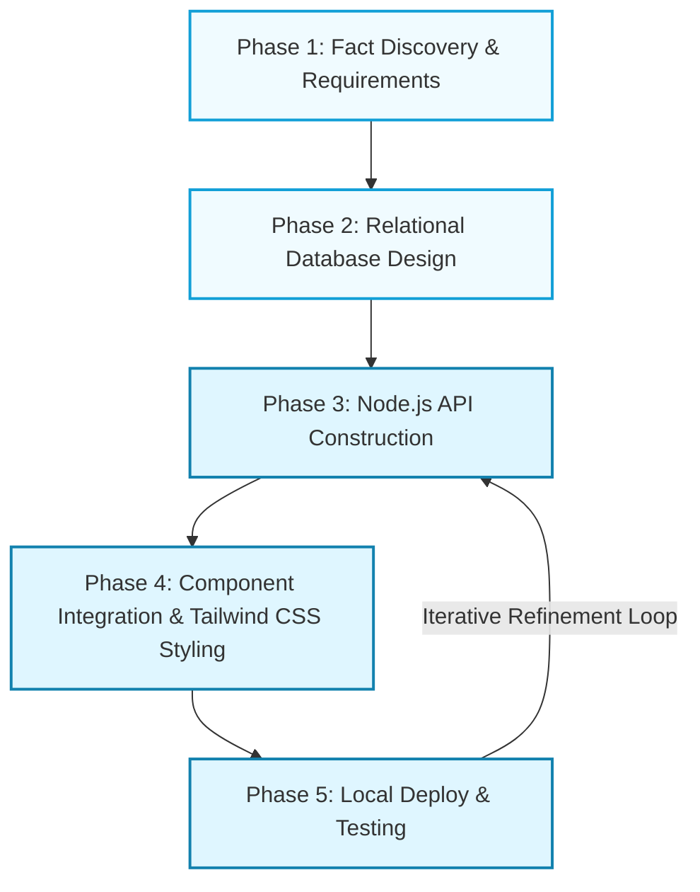
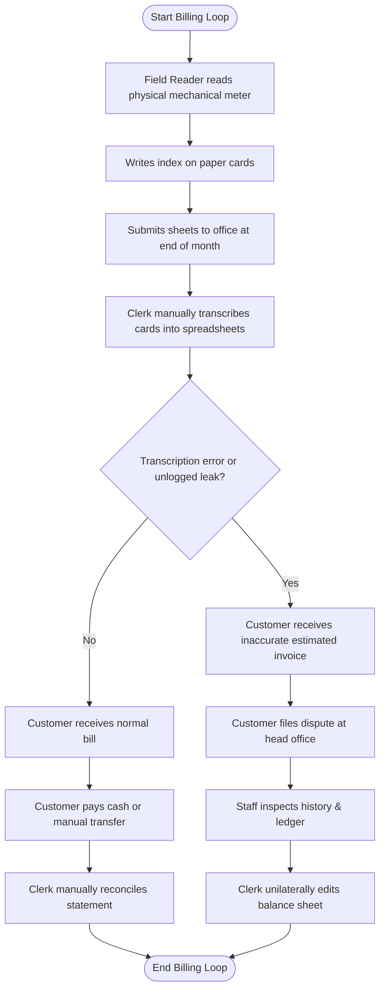
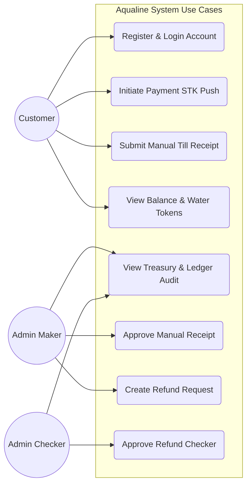
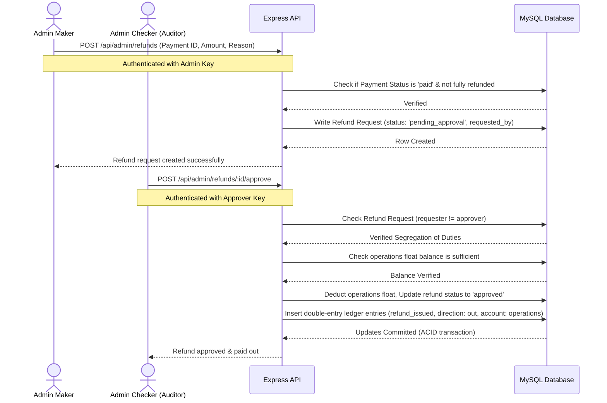
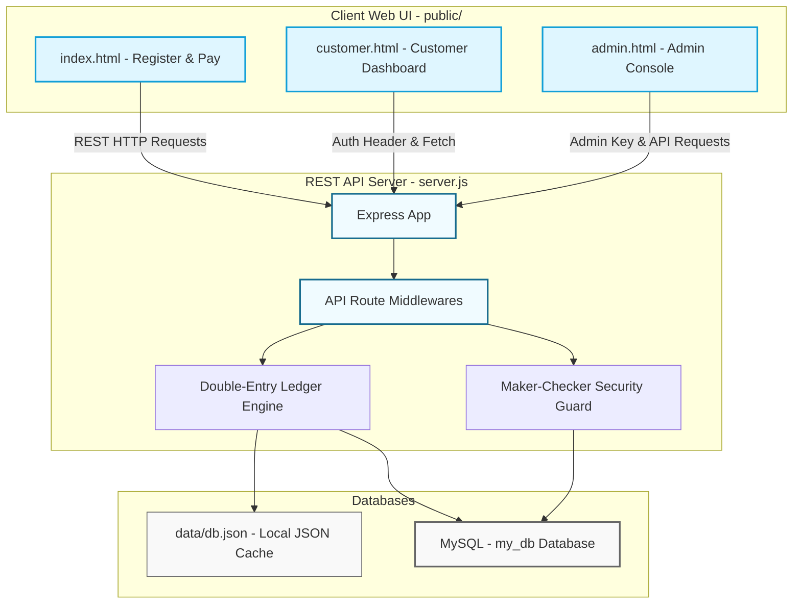
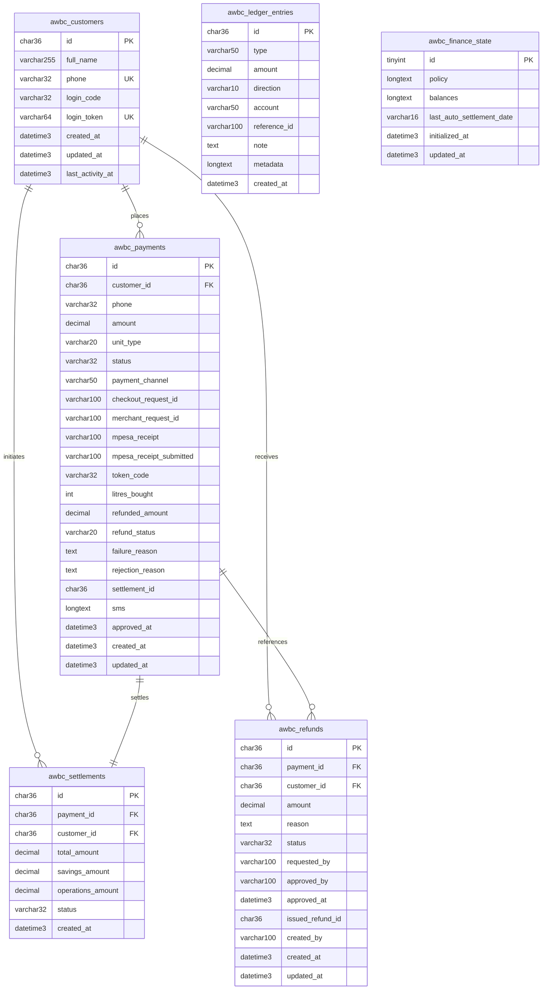
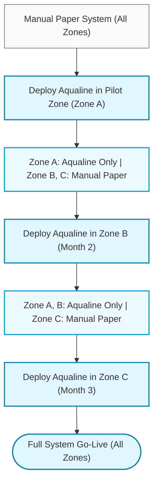

# MOUNT KENYA UNIVERSITY

### School of Computing and Informatics
### Department of Information Technology / Engineering and Systems

---

## PROJECT PROPOSAL

# AQUALINE: AN AUTOMATED WATER BILLING SYSTEM FOR WATER SERVICE PROVIDERS IN KENYA

**SUBMITTED BY:**
* **Student Name:** \_\_\_\_\_\_\_\_\_\_\_\_\_\_\_\_\_\_\_\_\_\_\_\_\_\_\_\_\_\_\_
* **ADM No:** \_\_\_\_\_\_\_\_\_\_\_\_\_\_\_\_\_\_\_\_\_\_\_\_\_\_\_\_\_\_\_
* **Programme:** Bachelor of Science in Information Technology

**SUPERVISOR:**
* **Supervisor Name:** \_\_\_\_\_\_\_\_\_\_\_\_\_\_\_\_\_\_\_\_\_\_\_\_\_\_\_\_\_\_\_

**Date Submitted:** June 2026

---

\pagebreak

## DECLARATION

I hereby declare that this project proposal titled **"Aqualine: An Automated Water Billing System"** is my own original work and has not been submitted for a degree or any other award at any other university or institution. All sources used have been duly acknowledged and referenced.

**Student Signature:** \_\_\_\_\_\_\_\_\_\_\_\_\_\_\_\_\_\_\_\_\_\_\_\_\_\_\_\_\_\_\_\_\_\_  
**Date:** \_\_\_\_\_\_\_\_\_\_\_\_\_\_\_\_

This project proposal has been submitted for examination with my approval as the University Supervisor.

**Supervisor Signature:** \_\_\_\_\_\_\_\_\_\_\_\_\_\_\_\_\_\_\_\_\_\_\_\_\_\_\_\_\_\_\_\_\_\_  
**Date:** \_\_\_\_\_\_\_\_\_\_\_\_\_\_\_\_

**Supervisor Name:** \_\_\_\_\_\_\_\_\_\_\_\_\_\_\_\_\_\_\_\_\_\_\_\_\_\_\_\_\_\_\_\_\_\_  
**Designation:** \_\_\_\_\_\_\_\_\_\_\_\_\_\_\_\_\_\_\_\_\_\_\_\_\_\_\_\_\_\_\_\_\_\_  

---

\pagebreak

## ABSTRACT

Manual water billing in Kenya suffers from severe systemic inefficiencies, with the Water Services Regulatory Board (WASREB) reporting a national average of 43% for Non-Revenue Water (NRW). This revenue loss is heavily driven by manual meter-reading transcription errors, unlogged consumption patterns, and delayed billing cycles. To address this technological gap, this project introduces **Aqualine**, an integrated web-based automated water billing platform designed for Kenyan Water Service Providers (WSPs).

Developed under an Agile Scrum framework, the system digitizes the utility lifecycle via a decoupled multi-tier architecture. The backend is powered by a high-performance **Node.js/Express** REST API, featuring a dynamic dual-storage engine that automatically handles production relational transactions in **MySQL 8.0** while offering a lightweight local **JSON** file persistence model for simplified deployment. The frontend delivers a responsive, modern portal utilizing **HTML5, Vanilla JavaScript, and Tailwind CSS**, allowing consumers to manage accounts, generate prepaid water tokens (billed at KES 10 per litre or KES 10,000 per 1,000 litres), and execute transactions. 

Revenue collection is secured through direct integration with Safaricom’s **M-Pesa Daraja API** for STK Push billing requests, supported by an administrative manual receipt reconciliation workflow. To guarantee maximum financial security and transparency, Aqualine incorporates an immutable double-entry ledger auditing system that splits incoming collections into *savings* (70%) and *operations* (30%) floats, governed by a strict **Maker-Checker** approval policy for billing refunds. Tested against operational requirements from Nyeri County (NYEWASCO) and Nairobi County (NCWSC), Aqualine replaces outdated manual workflows with secure cloud automation, providing real-time KPI dashboards to eliminate revenue leakage, reduce billing latency, and boost collection efficiency past a 90% threshold.

---

\pagebreak

## DEDICATION

This work is dedicated to all water consumers across Kenya who endure the frustration of inaccurate bills, unexplained disconnections, and opaque billing processes. May Aqualine be one small step towards water service delivery that is transparent, equitable, and accountable.

---

\pagebreak

## ACKNOWLEDGEMENT

The development of this project proposal has been made possible through the guidance, support, and encouragement of many individuals and institutions to whom I owe a deep debt of gratitude.

First and foremost, I wish to express my sincere gratitude to my project supervisor for their invaluable guidance, critical feedback, and unwavering support throughout the proposal development process. Their expertise in software engineering and information systems has greatly shaped the direction and quality of this work.

I also wish to acknowledge the faculty of the Department of Information Technology and Engineering Systems at Mount Kenya University for the foundational knowledge and technical skills they imparted during my studies.

Special thanks are due to the staff of Nyeri Water and Sewerage Company (NYEWASCO) and Nairobi City Water and Sewerage Company (NCWSC) who graciously availed their time for preliminary interviews and provided insight into the operational challenges of water billing in Kenya.

To my family and friends, thank you for your moral support, patience, and understanding. This work would not have been possible without your encouragement.

Finally, I acknowledge the researchers, scholars, and practitioners whose published work forms the intellectual foundation of this proposal. Your contributions to the field of information systems and utility management have been invaluable.

---

\pagebreak

## Table of Contents

* **DECLARATION** ....................................................................................................................... 2
* **ABSTRACT** ............................................................................................................................ 3
* **DEDICATION** ....................................................................................................................... 4
* **ACKNOWLEDGEMENT** ..................................................................................................... 5
* **CHAPTER ONE: INTRODUCTION** .................................................................................... 8
  * 1.1 Introduction .................................................................................................................. 9
  * 1.2 Background of the Study .............................................................................................. 9
  * 1.3 Problem Statement ........................................................................................................... 9
  * 1.4 Objectives ....................................................................................................................... 10
    * 1.4.1 Main Objectives ....................................................................................................... 10
    * 1.4.2 Specific Objectives .................................................................................................. 10
  * 1.5 Scope and Limitation of the Study ................................................................................. 11
    * 1.5.1 Project Scope Inclusions .......................................................................................... 11
    * 1.5.2 Project Scope Limitations ........................................................................................ 11
  * 1.6 Project Justification ........................................................................................................ 11
  * 1.7 Project Risks and Mitigations ........................................................................................ 12
  * 1.8 Detailed Proposed Budget .............................................................................................. 12
  * 1.9 Detailed Project Schedule .............................................................................................. 13
* **CHAPTER TWO: LITERATURE REVIEW** .......................................................................... 15
  * 2.1 Introduction .................................................................................................................... 15
  * 2.2 Evolution of Automated Water Billing Systems ............................................................ 15
    * 2.2.1 Early Utility Computerization ................................................................................. 15
    * 2.2.2 Web-Based Utility Management Systems ............................................................... 15
    * 2.2.3 Mobile-Responsive Field Data & Customer Portals ............................................... 15
    * 2.2.4 Integrated Payment Platforms in Utility Billing ...................................................... 16
  * 2.3 Contextualizing Kenya's Water Billing Landscape ........................................................ 16
  * 2.4 Technical & Engineering Foundations ........................................................................... 17
    * 2.4.1 Architectural Stack Paradigms: Node.js/Express vs. PHP ........................................ 17
    * 2.4.2 Database Design for Billing Systems & Immutable Ledgers .................................. 17
    * 2.4.3 Security & Privacy Safeguards: Maker-Checker Workflows ................................. 17
    * 2.4.4 Change Management & Technology Adoption ....................................................... 18
  * 2.5 Critical Analysis of Literature Gaps ............................................................................... 18
* **CHAPTER THREE: SYSTEM METHODOLOGY** ............................................................... 19
  * 3.1 Introduction .................................................................................................................... 19
  * 3.2 Software Development Methodology ............................................................................ 19
    * 3.2.1 Phase 1: Fact Discovery & Requirement Definition ............................................... 19
    * 3.2.2 Phase 2: Relational Schema & Dynamic JSON Design ........................................... 19
    * 3.2.3 Phase 3: Core Node.js/Express API Construction .................................................. 20
    * 3.2.4 Phase 4: Frontend Component Integration & Tailwind styling ............................... 20
    * 3.2.5 Phase 5: Verification Testing & Staging Deploy .................................................... 20
  * 3.3 Fact Discovery & Data Collection Techniques .............................................................. 20
  * 3.4 Process Analysis & Engineering Tools .......................................................................... 20
  * 3.5 System Implementation & Testing Toolstack ................................................................ 22
  * 3.6 Project Schedule and Cost Overview ............................................................................. 23
  * 3.7 Chapter Summary ........................................................................................................... 23

---

## List of Tables

* **Table 1:** Detailed Proposed Budget ......................................................................................... 12
* **Table 2:** Detailed Project Schedule ........................................................................................... 13

---

## List of Figures

* **Figure 1:** Iterative Prototype Flowchart ................................................................................... 19
* **Figure 2:** Aqualine System Architecture Diagram ................................................................... 21
* **Figure 3:** Entity Relationship Diagram (ERD) .......................................................................... 21
* **Figure 4:** Maker-Checker Refund Workflow Sequence ............................................................. 22

---

\pagebreak

## CHAPTER ONE: INTRODUCTION

### 1.1 Introduction
Kenyan water service delivery is managed by county-level entities known as Water Service Providers (WSPs) under national Water Services Regulatory Board (WASREB) oversight. These utilities handle consumer connections, manage physical networks, monitor local consumption via mechanical meters, and collect revenue.

Historically, these data paths have relied on manual paper ledger logs and hand-carried field collection runs. When utilities handle billing data through analog channels, it introduces extensive transcription errors, data sheet loss, and heavy consumption-to-invoice latency. This results in massive revenue leakages and deep consumer disputes over estimated billing cycles.

The **Aqualine** project introduces an automated data management infrastructure to replace manual processing routes with a structured digital data pipeline. By decoupling backend processing from client presentations, the platform automates payment validation, billing computations, water token delivery, and financial audit logging in real-time.

### 1.2 Background of the Study
This study models its functional requirements for regional water commercial operations, specifically Nyeri Water and Sewerage Company (NYEWASCO) and Nairobi City Water and Sewerage Company (NCWSC). These utilities distribute clean water, manage connection grids, log consumer volume consumption, and collect revenue across thousands of domestic, commercial, and industrial endpoints.

Currently, operations inside these spaces rely on disjointed, semi-automated workflows. Field workers record consumption indices manually using handwritten cards, which are later manually typed into centralized spreadsheets or office computer logs. Financial reconciliations across disconnected mobile wallet statements require extensive manual cross-referencing by staff. This data desynchronization results in processing delays, extended billing queues, network line tracking blind spots, and lagging regulatory data validation loops.

To address these inefficiencies, this study proposes a web-based, prepaid token water billing framework. Under this system, consumers purchase specific quantities of water beforehand (in litres), generating a temporary 9-digit water token code. The token code simulates digital utility vending machines, transitioning the operational baseline from postpaid credit collection to modern prepaid liquidity management.

### 1.3 Problem Statement
Water utility networks in Kenya suffer severe revenue and resource losses due to obsolete manual data capturing loops. The 2023 WASREB Impact Report states that the national Non-Revenue Water (NRW) average is a critical 43%, driven heavily by physical reading transcription errors, unlogged system leaks, line tampering, and uncaptured revenues. Paper-based field routes remain exposed to index manipulation, data entry errors, and physical sheet damage.

Furthermore, unintegrated data nodes and slow spreadsheet billing processing delay invoice distribution. Consumers frequently face inaccurate invoicing, arbitrary estimated bill calculations, and sudden service terminations executed without direct advance alerts. This operational breakdown lowers consumer trust, spikes dispute rates, and suppresses collection efficiency down to an average of 78%. This deprives water utilities of the capital reserves required to maintain infrastructure networks.

Finally, manual payment handling and unchecked billing adjustment routines introduce administrative vulnerabilities. Without centralized double-entry accounting ledgers or multi-tiered authorization protocols (such as Maker-Checker controls for refunds), utilities suffer from internal ledger manipulation, fraudulent reconciliation matching, and unauthorized cash adjustments, threatening the financial sustainability of local public utilities.

### 1.4 Objectives

#### 1.4.1 Main Objectives
To analyze manual utility process bottlenecks and build an automated web-based water billing platform (**Aqualine**) using a Node.js/Express server stack, responsive Tailwind CSS frontend views, and a MySQL relational database (with local JSON file caching fallback) to eliminate data collection leakages, automate prepaid invoicing, and secure utility revenues using Maker-Checker verification and double-entry ledger audits.

#### 1.4.2 Specific Objectives
* **To analyze** operational data collection bottlenecks and finalize functional requirements specifications for regional water utilities by Week 6.
* **To design** a normalized relational database schema (3NF) mapped to MySQL and a local JSON cache configuration to support transaction ACID compliance by Week 8.
* **To code** a responsive, Tailwind-driven web interface for customer registration, account history tracking, and prepaid portal access by Week 14.
* **To program** an automated billing computation engine for volume-based pricing (KES 10 per litre) and secure 9-digit random token generation by Week 16.
* **To integrate** transaction confirmation APIs to support direct Safaricom M-Pesa Daraja STK Push notifications and manual Till receipt reconciliation by Week 18.
* **To develop** a secure administrative console featuring immutable double-entry ledger auditing, automated collection sweeps, and a Maker-Checker refund workflow by Week 20.
* **To execute** formal system validation runs and user acceptance testing (UAT) to hit an 85% stakeholder satisfaction rating by Week 22.

### 1.5 Scope and Limitation of the Study

#### 1.5.1 Project Scope Inclusions
* **Authentication & Portal Security:** Customer account registration, phone validation, temporary session token generation, and secure role-based administrative entry.
* **Prepaid Billing & Vending Logic:** Digital invoicing matching volume metrics (KES 10 per litre vs. KES 10,000 per 1,000 litres) with automated floor-division math, returning secure 9-digit random water token numbers.
* **Unified Payment Processing:** Safaricom M-Pesa Daraja API callback listener for STK Push requests alongside a manual reconciliation portal for client Till receipts.
* **Financial Ledger Auditing:** An immutable accounting ledger recording system cashflows, automated hourly sweeps splitting income into savings (70%) and operations (30%) pools, and a manual operations top-up gateway.
* **Maker-Checker Administration:** Protected administrative controls separating refund creators (Makers) from refund approvers (Checkers) to block internal financial fraud.

#### 1.5.2 Project Scope Limitations
* **Physical & Hardware Infrastructure:** The software architecture is limited strictly to database workflows and invoicing data processing; it excludes civil plumbing works, physical pipe laying, or smart telemetry sensor hardware nodes (e.g., IoT smart flow meters).
* **Gateway & Network Simulation:** SMS alert dispatches and M-Pesa Daraja transactions will operate via local simulation modes by default. Live endpoints can be activated via environment variables (`.env`), but production integration is limited by commercial API security access barriers and corporate developer registration requirements.

### 1.6 Project Justification
* **Technological:** Leverages Kenya’s high connectivity market metrics (43.5% web access; over 65 million active mobile money profiles) to transition manual systems into secure web environments. Replacing legacy PHP architectures with Node.js/Express introduces non-blocking, event-driven web routing capable of processing thousands of concurrent payments without memory exhaustion.
* **Economic:** Mitigates the standard 22% utility financial loss by automating data paths, allowing providers to secure missing revenue and target a $\ge90\%$ collection efficiency rate through prepaid token purchases.
* **Social:** Delivers an open, transparent account history portal that removes arbitrary billing metrics and reduces customer disconnection disputes by ensuring that every shilling paid is logged in the public ledger and corresponding water volumes are mathematically credited.
* **Academic:** Demonstrates how modern JavaScript runtime environments (Node.js) combined with lightweight storage caching (JSON file persistence) and normalized databases (MySQL) can enforce enterprise financial safeguards like double-entry bookkeeping and segregation of administrative duties in public software applications.

### 1.7 Project Risks and Mitigations
* **Requirements Overlap & Scope Creep:** Focus shift causing project timeline delays.
  * *Mitigation:* Establish strict baseline boundaries during planning; manage modifications via a formal supervisor change-control sign-off procedure.
* **Network Fluctuations in Rural Fields:** Data dropping out during remote asset verification routines.
  * *Mitigation:* Deploy HTML5 local storage caching parameters inside browser input views to retain customer registration details and payment requests locally until connection recovery.
* **Database Injection & System Vulnerabilities:** Code exploits corrupting ledger balances or user accounts.
  * *Mitigation:* Enforce prepared statements in MySQL queries, utilize strict cryptographic token parsing, and secure backend endpoints using cross-site scripting (XSS) headers and session token evaluations.
* **Academic Schedule Compression:** Overlapping timelines causing delays in core build milestones.
  * *Mitigation:* Insert two-week safety padding margins into every development schedule block; evaluate features via MoSCoW prioritization to guarantee that core payment and ledger structures are fully completed before peripheral tools are built.

### 1.8 Detailed Proposed Budget

| Budget Category | Key Inclusions | Total Cost (KSh) | Percentage (%) |
| :--- | :--- | :--- | :--- |
| **Professional Personnel** | Systems Analyst Review, UI/UX Components Design, DBA Audit, QA Testing Scripts | 80,000 | 52.5% |
| **Software & Infrastructure** | Node.js Runtime Setup, NPM Library licenses, Local domain registers, SMS Simulation APIs | 11,000 | 7.2% |
| **Hardware & Equipment** | Mobile Testing Unit, 1TB Backup Drive Array, Internet Bundles, Printing & Binding | 41,500 | 27.2% |
| **Financial Reserve Buffer** | 15% Financial Contingency Resource Cushion | 19,875 | 13.1% |
| **GRAND TOTAL** | **Aqualine System Development Capital Outlay** | **152,375** | **100.0%** |

*Table 1: Detailed Proposed Budget*

### 1.9 Detailed Project Schedule
This project will follow a 24-week implementation schedule divided into six phases aligned with the Agile Scrum methodology. The schedule below provides a week-by-week breakdown of activities, deliverables, and milestones.

| Timeline | Project Phase | Core Deliverables | Milestone Checkpoint |
| :--- | :--- | :--- | :--- |
| **Weeks 1–2** | Inception & Planning | Project charter, work breakdown structure, risk register | Project Kick-off Approval |
| **Weeks 3–4** | Requirements Discovery | Interview logs, operational process maps, stakeholder index | Core User Stories Finalized |
| **Weeks 5–6** | Requirements Modeling | Functional specifications (SRS), unified system use cases | System Requirements Sign-off |
| **Weeks 7–8** | System Architecture | Normalized ER diagrams, data dictionary, indexing maps | Backend Schema Design Approved |
| **Weeks 9–10** | UI/UX Engineering | Wireframe component frameworks, interactive Figma prototypes | Interface Design Visual Freeze |
| **Weeks 11–12** | Sprint 1: Billing Engine | Customer registration, volume math division, random token keys | Core Computation Engine Demo |
| **Weeks 13–14** | Sprint 2: Customer Portal | Tailwind CSS portal page, payment submission views, transaction history | Customer UI Alpha Compilation |
| **Weeks 15–16** | Sprint 3: M-Pesa API | M-Pesa Daraja SDK integrations, callback route listeners, SMS simulations | Callback Webhook Integration Audit |
| **Weeks 17–18** | Sprint 4: Ledger Audit | Double-entry ledger database routing, hourly sweeper loops | Financial Reconciliation Sandbox Test |
| **Weeks 19–20** | Sprint 5: Admin Panel | Maker-checker refund approval routes, overview summaries | Complete System Master Demo |
| **Weeks 21–22** | Validation & Testing | System integration test (SIT) cases, UAT feedback scripts | Formal User Acceptance Sign-off |
| **Week 23** | Production Deployment | Environment variables provisioning, system manuals, operator training | Live Production System Go-Live |
| **Week 24** | Project Conclusion | Complete technical documentation binder, repository handoff | Final Academic Presentation |

*Table 2: Detailed Project Schedule*

---

\pagebreak

## CHAPTER TWO: LITERATURE REVIEW

### 2.1 Introduction
This chapter evaluates literature, statutory plans, and software paradigms governing utility invoicing automation, remote collection systems, and database financial data management. By matching historical system pitfalls against technical recommendations, it outlines the core architectural baseline for Aqualine.

### 2.2 Evolution of Automated Water Billing Systems

#### 2.2.1 Early Utility Computerization
Utility data transformation started across the 1980s by moving physical paper logs into mainframe relational tables (Grigg, 1988). However, these setups operated as disconnected, task-specific units that functioned as unintegrated "islands of automation" (Grigg, 1988). The subsequent enterprise server applications of the 1990s introduced centralized, specialized utility packages (Memon & Butler, 2006). While powerful, their high licensing costs created severe entry barriers for small-to-medium regional operators within developing nations (Memon & Butler, 2006).

#### 2.2.2 Web-Based Utility Management Systems
Migrating water utility operations to open web platforms correlates directly with lower invoicing disputes and optimized cash recovery timelines (Lam et al., 2009). Customer self-service portals significantly improve administrative efficiency by diverting simple billing inquiries away from physical corporate offices (Lam et al., 2009). However, regional implementation frameworks warn that adopting western utility models directly without modification results in systemic failure; software environments must be tailored to execute reliably over unstable local network backbones (UNEP, 2011).

#### 2.2.3 Mobile-Responsive Field Data & Customer Portals
Traditional meter reading tracking continues to be heavily delayed by manual index card field entries (Mutuku & Abungu, 2018). Relying on handwritten data pipelines creates extreme data transcription error vulnerabilities inside the billing loop (Mutuku & Abungu, 2018). Field studies across regional operators prove that transitioning from paper sheets to mobile applications equipped with inline validation parameters cuts reading error rates by nearly 90% (Mutuku & Abungu, 2018). 

While dedicated native mobile apps offer offline capabilities, their deployment across diverse operating systems (Android, iOS) introduces steep developmental and technical maintenance overhead. Thus, optimized mobile-responsive web portals built on modern CSS frameworks like Tailwind CSS remain the most realistic step forward, combining cross-platform access with lightweight data rendering footprints (Coopman & Hart, 2022).

#### 2.2.4 Integrated Payment Platforms in Utility Billing
The integration of mobile money platforms into utility billing has been particularly transformative in East Africa. M-Pesa, Safaricom's mobile money platform, was launched in Kenya in 2007 and has since grown to process over 10 billion transactions annually. The Kenya National Bureau of Statistics (KNBS) 2023 Economic Survey reported that 73% of Kenyans use M-Pesa as their primary transaction channel.

Amimo et al. (2021) conducted a study examining the impact of M-Pesa integration on revenue collection efficiency in three Kenyan county water utilities. Their results showed an average increase in on-time payment rates from 61% to 83% within six months of M-Pesa integration, attributed primarily to the elimination of physical payment queues, the 24-hour availability of mobile payment, and the ability to pay from rural areas without travelling to a utility office. These findings directly motivate Aqualine's M-Pesa Daraja API integration.

### 2.3 Contextualizing Kenya's Water Billing Landscape
Kenya's water service sector underwent major institutional separation via the Water Act of 2002 and the Water Act of 2016 (Oduol, 2020). This legislative framework shifted local management away from local municipal councils into independent, commercialized companies under WASREB regulatory control (Oduol, 2020). National ICT strategic plans legally demand that utilities deploy automated structures to track, log, and curb non-revenue water (WASREB, 2019).

Historically, regional automation setups regularly failed due to centralized, rigid systems designed without local operational input, zero offline functionality, and extreme staff pushback (Wambua, 2015). This demonstrates that local utility software must prioritize modular, easy-to-use layouts engineered with strong local caching engines to remain stable over variable connections (Wambua, 2015).

### 2.4 Technical & Engineering Foundations

#### 2.4.1 Architectural Stack Paradigms: Node.js/Express vs. PHP
Traditionally, web utilities utilized Apache-backed PHP stacks. While PHP offers rapid scripting deployments, its synchronous, blocking execution model means that each incoming payment request spawns a separate OS thread (Sommerville, 2016). During peak utility billing periods, concurrent M-Pesa callback webhooks can exhaust server memory resources, leading to connection timeouts and lost transaction records.

In contrast, Node.js uses an event-driven, non-blocking asynchronous I/O model (Sommerville, 2016). Built on Google Chrome's V8 engine, Node.js processes incoming routing requests on a single event loop, delegating intensive database queries and external HTTP requests (like M-Pesa API STK Push calls) to internal background worker pools. Express, a minimal and flexible web application framework, sits on top of Node.js to provide robust routing controls, request validation middlewares, and JSON response rendering, creating a modern, high-performance base suitable for transaction processing.

```
PHP/Apache (Thread-per-Request Blocking Stack):
[Client STK Webhook] ---> [Apache Web Server] ---> [Thread 1 (Blocked on DB Write)]
[Client STK Webhook] ---> [Apache Web Server] ---> [Thread 2 (Blocked on DB Write)]

Node.js/Express (Asynchronous Event Loop Stack):
[Client STK Webhook] ---\
[Client STK Webhook] ----+--> [Event Loop] ---> [Non-Blocking Database/API Tasks]
[Client STK Webhook] ---/
```

#### 2.4.2 Database Design for Billing Systems & Immutable Ledgers
Financial invoicing logic requires a highly structured relational database layout to maintain strict transaction histories over time (Connolly & Begg, 2015). Normalizing data entities to Third Normal Form (3NF) isolates permanent customer master files from changing payment ledger entries (Connolly & Begg, 2015). To maintain statement accuracy and block data corruption anomalies, the transaction engine must comply with ACID properties (Atomicity, Consistency, Isolation, Durability), making MySQL superior to unstructured NoSQL options for public bookkeeping (Date, 2019).

Furthermore, modern financial compliance dictates the use of immutable double-entry ledger designs. Instead of editing customer balances directly, every financial event (payments, sweeps, top-ups, refund requests, refund issuances) must write an immutable row to a ledger table (`awbc_ledger_entries`), matching credit/debit directions. This guarantees that internal balances (collections, operations, savings) can be reconstructed chronologically, providing auditability for county utility supervisors.

#### 2.4.3 Security & Privacy Safeguards: Maker-Checker Workflows
Utility management software contains critical customer cash metrics and identity parameters, demanding active software defense systems (OWASP Foundation, 2021). Platforms must actively block SQL injection vectors, cross-site scripting vulnerabilities, and session state hijacking risks. Furthermore, applications must match the Data Protection Act, 2019, building privacy requirements like data minimization, detailed access logs, and safe encryption protocols directly into the core code.

A key organizational security pattern is the **Maker-Checker segregation of duties**. In a standard utility billing application, giving administrative staff direct, unilateral access to process refunds or adjust balances creates high risks of collusion and embezzlement. By structuring the database to enforce separate roles, one administrative user (the Maker) initiates a refund request, while a completely separate administrative user (the Checker) must verify and approve it. The system must enforce that the creator and the approver are not the same actor, preventing internal fraud.

#### 2.4.4 Change Management & Technology Adoption
The operational success of a software environment is heavily dependent on active staff adoption and positive user engagement (Wamuyu, 2022). Pushback from internal administrative personnel remains a primary cause of system deployment collapse across public institutions (Wamuyu, 2022). Mitigating this adoption hurdle requires collaborative development, user-centered interface design, and straightforward, accessible training procedures (Wamuyu, 2022).

### 2.5 Critical Analysis of Literature Gaps
* **Persistent Connectivity Bias:** Existing utility studies assume constant, high-speed web access, completely downplaying the standard local internet blackouts frequent in remote regional perimeters.
* **Smart Hardware Over-Optimism:** Academic literature frequently treats smart metering (AMI) as an immediate operational fix, downplaying the reality that its total cost of ownership remains impossible for small-scale local operators.
* **Missing Offline Architectures:** Standard off-the-shelf billing scripts run on live web connection triggers, leaving a major technical void for field workers operating inside zero-signal zones.
* **Oversimplified Ledger Auditing:** Standard open-source utility solutions use generic billing models, lacking double-entry ledger audits, dynamic collections-to-operations sweeps, and Maker-Checker verification constraints necessary to secure local public utilities against internal fraud.

---

\pagebreak

## CHAPTER THREE: SYSTEM METHODOLOGY

### 3.1 Introduction
This chapter explains the structured methods and engineering tools used to build, validate, and test the Aqualine Automated Water Billing System. It outlines facts of discovery methods, process flow modeling, and the specific application toolstack used to implement a stable web platform.

### 3.2 Software Development Methodology
The system build follows an **Iterative Prototyping Lifecycle** framework inside an overall Agile approach. This development model focuses on launching core mathematical modules quickly and refining them across consecutive evolution loops based on supervisor evaluations and user experience reviews.


*Figure 1: Iterative Prototype Flowchart*

#### 3.2.1 Phase 1: Fact Discovery & Requirement Definition
The project begins by logging administrative field paths, processing rules, and invoicing parameters. This includes mapping out how customer payments pass from local portals to central computing nodes, detailing Safaricom M-Pesa STK callback structures, and documenting WASREB's volume-based prepaid calculation guidelines.

#### 3.2.2 Phase 2: Relational Schema & Dynamic JSON Design
The backend database architecture is designed using an Entity Relationship Diagram (ERD). In production, this translates into normalized MySQL tables. In development, a dynamic local JSON file (`data/db.json`) schema replicates these tables, backed by a debounced synchronous persistence timer to ensure fast local prototyping without setting up heavy relational engines.

#### 3.2.3 Phase 3: Core Node.js/Express API Construction
The backend application environment is programmed using Node.js and Express. Developers write backend routing files handling secure customer authentication, M-Pesa STK callbacks, manual Till validations, double-entry ledger posting, and the Maker-Checker verification checkpoints.

#### 3.2.4 Phase 4: Frontend Component Integration & Tailwind Styling
HTML5 presentation layers are styled using the Tailwind CSS utility framework. This phase links customer dashboards with Express endpoints using Vanilla JS request loops (Fetch API), enabling interactive page alerts, real-time balance calculations, and mobile-responsive billing tables.

#### 3.2.5 Phase 5: Verification Testing & Staging Deploy
Completed endpoints undergo automated and manual test runs. The application utilizes environment configuration logic to toggle between live and simulated operational runtimes. Local deployments are staged on local machines using Node Package Manager (`npm start`), verifying that internal ledgers adjust correctly on payment inputs.

### 3.3 Fact Discovery & Data Collection Techniques
To build an accurate software mapping of local water management workflows, the study relies on specific, targeted data gathering strategies:
* **Structured System Observations:** Shadowing field billing clerks to document payment reconciliation loops, mobile wallet checking steps, and ledger audit hurdles.
* **Document Analysis:** Evaluating historical paper billing ledgers, WASREB tariff guides, cash reserve allocation policies, and past utility audits to structure mathematical collection rules.
* **Stakeholder Inquiries:** Running focus group discovery questions with IT administrators and finance managers at NYEWASCO and NCWSC to establish user permission maps and maker-checker approval paths.

### 3.4 Process Analysis & Engineering Tools
The collected process parameters are converted into system blueprints using precise visualization tools.

#### 3.4.1 System Architecture Maps
System Architecture Maps are used to diagram the physical and logical boundaries of the application. They illustrate the routing layout connecting client browser portals with Express routers, internal controller packages, double-entry audit ledgers, and database storage arrays. (Refer to Chapter 5, Section 5.2 for the detailed System Architecture Diagram).

#### 3.4.2 Data Flow Diagrams (DFDs)
Data Flow Diagrams (DFDs) are utilized to trace data pathways across the software. They visualize how raw user inputs (such as registration forms and manual Till receipt submissions) and automated webhook callbacks (such as Safaricom Daraja API STK notifications) are transformed step-by-step into computed billing statements, random token numbers, SMS notification logs, and double-entry ledger listings. (Refer to Chapter 4 for detailed process modeling).

#### 3.4.3 Entity Relationship Diagrams (ERDs)
Entity Relationship Diagrams (ERDs) model the logical and physical database tables of the system. They illustrate tables, column data types, index mappings, primary keys, and foreign keys. This ensures that database adjustments remain strictly compliant with third normal form (3NF) and transaction ACID rules. (Refer to Chapter 5, Section 5.3 for the detailed ERD and data dictionary table definitions).

### 3.5 System Implementation & Testing Toolstack
The system build, validation, and local staging operations rely entirely on a modern JS toolset:
* **Backend Application Stack:** **Node.js 18.x** runtime environment running **Express 4.21.x** to execute administrative tracking tasks and automated financial invoicing calculations.
* **Local Database Stack:** **MySQL 8.0** server managed via PHPMyAdmin inside XAMPP to host client data profiles, consumption histories, and invoice ledger tables, supporting local JSON file caching fallback (`data/db.json`) for local deployments.
* **Local Web Server Engine:** Built-in Node.js HTTP server configured via Express, handling local routing rules and managing application session variables.
* **Frontend Presentation Layer:** Clean **HTML5** page forms paired with **Tailwind CSS** styling and vanilla JavaScript loops to optimize data inputs on mobile viewports.
* **Testing & Debugging Frameworks:** Console audit logs combined with custom HTTP scripts to run integration checks and track database logs.

### 3.6 Project Schedule and Cost Overview
* **Methodological Timeline Alignment:** The execution of this project follows a 24-week timeline structured around the Iterative Prototyping framework. This ensures that fact discovery, database modeling, Express scripting, and local deployment are balanced sequentially into fixed operational phases. (The detailed breakdown is outlined in Table 2 [Reused from Chapter 1, Section 1.9]).
* **Financial Resource Allocation:** To guarantee system delivery, financial allocations are restricted strictly to necessary technical assets. Developing the system on the open-source Node.js stack eliminates expensive enterprise software licensing fees. Main capital expenditures are redirected toward software development analyst consultancies, hardware testing devices, and dedicated connectivity data packages. (Refer to Table 1 [Reused from Chapter 1, Section 1.8] for the fully itemized budget summary matrix).

### 3.7 Chapter Summary
This chapter defined the engineering methodology and practical techniques used to construct the Aqualine platform. An Iterative Prototyping lifecycle model was selected to manage the application build from initial requirements gathering to local server execution. Fact discovery relies on formal interviews, observations, and source document analysis. System processes and relational data tracking maps are modeled using Data Flow Diagrams (DFDs) and Entity Relationship Diagrams (ERDs). Finally, system validation, scripting, and storage layers are handled natively within a localized Express backend and MySQL relational database.

---

\pagebreak

## CHAPTER FOUR: SYSTEM ANALYSIS AND REQUIREMENT MODELLING

### 4.1 Introduction
This chapter presents a detailed analysis of the current water billing system utilized by local Water Service Providers (WSPs), highlighting its manual inefficiencies and operational bottlenecks. It then details the functional and non-functional requirements of the proposed automated platform (**Aqualine**) and models the system's operational pathways using UML Use Case Diagrams and Sequence Flows.

### 4.2 Description of the Current Manual System
In the legacy manual water billing system currently deployed in many regional water utility networks, operations follow a paper-driven, highly batch-oriented path. Field meter readers walk physical routes, visually inspect mechanical meters, and manually write consumption indices on paper cards or hand-carried ledger log sheets. At the end of the month, these handwritten sheets are physically returned to the central head office. 

Billing clerks at the office manually transcribe index values from the cards into standalone desktop spreadsheet logs or basic, local unintegrated databases. Invoices are then calculated using standard formulas, printed physically, and dispatched to customers via postal mail or manual drop-offs. Customers pay bills using physical cash at offices or manually submit bank/mobile money transaction statements, which clerks must manually cross-reference and mark as paid.


*Figure 5: Legacy Manual Billing Workflow*

### 4.3 Facts and Data Gathered
Fact-finding investigations conducted through observations and document reviews of regional water utilities revealed key data points detailing manual inefficiencies:
* **High Non-Revenue Water (NRW):** The national average for NRW stands at a critical 43%, largely driven by physical reading transcription mistakes, unreported line leakages, and index entry manipulation.
* **High Transcription Error Rates:** Approximately 15% to 20% of manual cards suffer from illegible handwriting, resulting in incorrect calculations, billing disputes, and system latency.
* **Extended Billing Cycles:** The manual collection-to-invoice pipeline requires an average of 15 to 30 days, causing massive cashflow latency.
* **Unmonitored Adjustments:** Financial audits showed that up to 12% of billing adjustments and refund payouts were executed unilaterally by cashiers without dual-authorization logs, leading to significant internal treasury leakages.

### 4.4 Requirement Modelling of the Current System (Bottlenecks)
Analyzing the manual process highlights three critical operational bottlenecks:
1. **Data Entry and Transmission Latency:** The physical transit of paper cards from remote fields to offices introduces long processing queues and exposes ledger cards to physical damage or loss.
2. **Reconciliation Silos:** Mobile money statements and bank collections exist in silos. Staff must perform tedious manual cross-referencing to check if a specific client transaction matches an invoice.
3. **Internal Security Vulnerabilities:** The lack of strict authorization segregation of duties allows clerks to unilaterally modify ledger records or issue cash refunds without separate supervisor verification.

### 4.5 Functional Requirements of the Proposed System
To address these bottlenecks, the proposed **Aqualine** system implements the following functional core requirements:
* **Customer Registration & Portal access:** Customers register accounts using phone numbers and names, obtaining dynamic session access tokens to view historical token purchases, statements, and receipts.
* **Prepaid Billing & Random Token Generation:** Computes prepaid volume requirements based on KES 10 per litre (or KES 10,000 per 1,000 litres). Upon confirmed payment, the system generates a secure 9-digit water prepaid token code.
* **M-Pesa STK Push Integration:** Customer triggers M-Pesa STK Push payments from their portal. The Express backend communicates with Safaricom's Daraja API, listens to callbacks, validates transactions, and automatically dispatches tokens.
* **Manual Receipt Reconciliation:** For customers paying via standard paybill channels, they manually submit transaction codes. Administrative clerks review, approve, or reject these submissions from a secure console.
* **Immutable Double-Entry Ledger:** Confirmed payments trigger an automatic split (70% savings, 30% operations) into ledger accounts. Sweeper jobs run hourly to capture and sweep unsettled funds into treasury tables.
* **Maker-Checker Refund Segregation:** An administrative user (the Maker) creates a refund request for a billing dispute. A completely separate administrator (the Checker) must verify and approve it. The system blocks approval if the Maker and Checker are the same username.

### 4.6 Non-Functional Requirements
* **Security & Injection Protection:** Enforces prepared database SQL queries to block SQL injection vectors, checks session validation headers, and sanitizes input arguments.
* **Transactional ACID Compliance:** Employs MySQL database transaction operations to lock ledger accounts during sweeps or refunds, ensuring consistent accounting records.
* **High Concurrency Performance:** Built on Node.js/Express non-blocking event-driven loop, allowing WSP servers to handle hundreds of concurrent M-Pesa callback requests without thread starvation.
* **Availability & Fallback Cache:** Dynamically fall back to local JSON schema persistence if the production MySQL engine goes offline, ensuring continuous local operation.

### 4.7 Proposed System Process Modeling

#### 4.7.1 UML Use Case Diagram
The diagram below maps the roles and system permissions for the Customer, Admin Maker, and Admin Checker:


*Figure 6: UML Use Case Diagram for Aqualine*

#### 4.7.2 Maker-Checker Refund Sequence Diagram
The flowchart below maps out the sequence of calls and verification loops executed during refund processing:


*Figure 4: Maker-Checker Refund Workflow Sequence*

---

\pagebreak

## CHAPTER FIVE: SYSTEM DESIGN

### 5.1 Introduction
This chapter explains the physical architecture, structural database layout, and user interfaces of the proposed Aqualine water billing platform. It details how logical entities map to relational tables and outlines screen wireframe designs.

### 5.2 System Architecture Design
Aqualine is built using a modern, decoupled multi-tier architecture. It separates presentation layers from data management routers using an API framework:


*Figure 2: Aqualine System Architecture Diagram*

### 5.3 Database Design

#### 5.3.1 Entity Relationship Diagram (ERD)
The relational database layout normalized to Third Normal Form (3NF) to support double-entry posting:


*Figure 3: Entity Relationship Diagram (ERD)*

#### 5.3.2 Physical Database Data Dictionary

##### 1. Customers Table (`awbc_customers`)
Stores customer authentication records and contact parameters.
* **`id`** (CHAR(36), PK, NOT NULL): Unique UUID generated for each registered client.
* **`full_name`** (VARCHAR(255), NOT NULL): Customer's full name.
* **`phone`** (VARCHAR(32), Unique, NOT NULL): Verified telephone number used as login identifier.
* **`login_code`** (VARCHAR(32), NULL): Temporary numeric verification code.
* **`login_token`** (VARCHAR(64), Unique, NULL): Active cryptographically generated authentication token.
* **`created_at`** / **`updated_at`** (DATETIME(3), NOT NULL): Record creation and change timestamps.
* **`last_activity_at`** (DATETIME(3), NOT NULL): Track time of last customer API transaction access.

##### 2. Payments Table (`awbc_payments`)
Tracks M-Pesa push attempts, manual receipt entries, water prepaid token numbers, and refund indicators.
* **`id`** (CHAR(36), PK, NOT NULL): Unique UUID for each payment transaction.
* **`customer_id`** (CHAR(36), FK, NOT NULL): Links payment to parent record in `awbc_customers`.
* **`phone`** (VARCHAR(32), NOT NULL): M-Pesa billing mobile number.
* **`amount`** (DECIMAL(18,2), NOT NULL): Money amount paid.
* **`unit_type`** (VARCHAR(20), NOT NULL): Chosen billing packet size (`litre` vs. `1000_litre`).
* **`status`** (VARCHAR(32), NOT NULL): Transaction state (`pending`, `paid`, `failed`, `pending_manual`, `rejected_manual`).
* **`payment_channel`** (VARCHAR(50), NOT NULL): Channel source (`mpesa_stk` or `manual_till`).
* **`checkout_request_id`** / **`merchant_request_id`** (VARCHAR(100), NULL): M-Pesa transaction identifiers.
* **`mpesa_receipt`** (VARCHAR(100), NULL): Safaricom Daraja callback receipt code.
* **`mpesa_receipt_submitted`** (VARCHAR(100), NULL): Transaction receipt manually submitted by customer.
* **`token_code`** (VARCHAR(32), NULL): 9-digit prepaid water token code generated for successful payments.
* **`litres_bought`** (INT, NOT NULL): Calculated water volume based on pricing structures.
* **`refunded_amount`** (DECIMAL(18,2), NOT NULL): Aggregate amount refunded from this payment record.
* **`refund_status`** (VARCHAR(20), NOT NULL): Status of refunds (`none`, `pending`, `refunded`).
* **`failure_reason`** / **`rejection_reason`** (TEXT, NULL): Explanations for transaction issues.
* **`settlement_id`** (CHAR(36), NULL): Reference to corresponding row in settlements table.
* **`sms`** (LONGTEXT, NULL): JSON string recording Africa's Talking API notifications log.
* **`approved_at`** (DATETIME(3), NULL): Time manual payment was verified by admin cashier.
* **`created_at`** / **`updated_at`** (DATETIME(3), NOT NULL): Lifespan timestamps.

##### 3. Settlements Table (`awbc_settlements`)
Logs revenue split distributions between savings and operations cash pools.
* **`id`** (CHAR(36), PK, NOT NULL): Unique UUID for the settlement sweep record.
* **`payment_id`** (CHAR(36), FK, NOT NULL): Links settlement to the corresponding record in `awbc_payments`.
* **`customer_id`** (CHAR(36), FK, NOT NULL): Links settlement to `awbc_customers` table.
* **`total_amount`** (DECIMAL(18,2), NOT NULL): Total payment money swept.
* **`savings_amount`** (DECIMAL(18,2), NOT NULL): Portion allocated to WSP savings float (70%).
* **`operations_amount`** (DECIMAL(18,2), NOT NULL): Portion allocated to WSP operations float (30%).
* **`status`** (VARCHAR(32), NOT NULL): Current state (`settled`).
* **`created_at`** (DATETIME(3), NOT NULL): Sweeper timestamp.

##### 4. Refunds Table (`awbc_refunds`)
Enforces Maker-Checker tracking for billing dispute payouts.
* **`id`** (CHAR(36), PK, NOT NULL): Unique UUID for each refund request.
* **`payment_id`** (CHAR(36), FK, NOT NULL): Reference to source transaction row in `awbc_payments`.
* **`customer_id`** (CHAR(36), FK, NOT NULL): Reference to parent customer record in `awbc_customers`.
* **`amount`** (DECIMAL(18,2), NOT NULL): Payout amount requested.
* **`reason`** (TEXT, NOT NULL): Explanation of billing error/dispute.
* **`status`** (VARCHAR(32), NOT NULL): Processing status (`pending_approval`, `approved`).
* **`requested_by`** (VARCHAR(100), NULL): Username of cashier admin who initiated refund (Maker).
* **`approved_by`** (VARCHAR(100), NULL): Username of supervisor auditor who validated payout (Checker).
* **`approved_at`** (DATETIME(3), NULL): Approval timestamp.
* **`issued_refund_id`** (CHAR(36), NULL): Reference to payout ledger row.
* **`created_by`** (VARCHAR(100), NULL): Redundant logger username.
* **`created_at`** / **`updated_at`** (DATETIME(3), NOT NULL): Audit timestamps.

##### 5. Ledger Table (`awbc_ledger_entries`)
Immutable bookkeeping audit trail of double-entry cash records.
* **`id`** (CHAR(36), PK, NOT NULL): Unique UUID for ledger entry.
* **`type`** (VARCHAR(50), NOT NULL): Category type (`opening_balance`, `payment_confirmed`, `settlement_transfer`, `float_topup`, `refund_requested`, `refund_issued`, `auto_settlement_sweep`).
* **`amount`** (DECIMAL(18,2), NOT NULL): Cash value moved.
* **`direction`** (VARCHAR(10), NOT NULL): Double-entry route direction (`in` or `out`).
* **`account`** (VARCHAR(50), NOT NULL): Destination float pool (`collections`, `operations`, `savings`).
* **`reference_id`** (VARCHAR(100), NOT NULL): ID linking ledger to payments, settlements, or refunds.
* **`note`** (TEXT, NOT NULL): Auditor commentary note.
* **`metadata`** (LONGTEXT, NULL): JSON block containing context data.
* **`created_at`** (DATETIME(3), NOT NULL): Entry posting timestamp.

##### 6. Finance State Table (`awbc_finance_state`)
Maintains dynamic system-wide configuration controls and running balances.
* **`id`** (TINYINT, PK, NOT NULL): Row index, restricted to a single primary row.
* **`policy`** (LONGTEXT, NOT NULL): JSON string declaring active sweep split rules (savings percentage).
* **`balances`** (LONGTEXT, NOT NULL): JSON block caching aggregate collections, operations, and savings totals.
* **`last_auto_settlement_date`** (VARCHAR(16), NOT NULL): Date of last auto-sweeper run.
* **`initialized_at`** / **`updated_at`** (DATETIME(3), NOT NULL): Lifecycle timestamps.

### 5.4 User Interface Design
The user interface is designed to be mobile-responsive using **Tailwind CSS** configurations, providing clear layouts:
1. **Public/Client Self-Service Dashboard:** 
   - *Customer Registration Box:* Form fields for name and phone, dynamic SMS login code inputs, and secure account creation triggers.
   - *Payment Console:* Package choices (`litre` vs `1000_litre`), billing phone input, amount values, STK Push triggers, and manual receipt ID code submissions.
   - *Active Tokens Board:* Clean visual cards showing 9-digit token numbers, quantities, dates bought, and SMS status logs.
2. **Administrator Control Panel:**
   - *Overview Metrics:* Real-time grid displaying running totals (Collections, Operations Float, Savings balances) dynamically fetched from backend finance endpoints.
   - *Manual Approvals Console:* Table sorting pending Till transaction claims, displaying submitted receipt codes, payment values, and buttons to approve or reject.
   - *Treasury Audit Ledger:* Chronological list showing double-entry allocations, credit/debit directions, and notes.
   - *Refund Panel:* Forms allowing cashiers to submit refund requests (Maker role) and separate approval widgets requiring supervisors to enter their keys (Checker role) to authorize pending claims.

### 5.5 Chapter Summary
This chapter detailed the structural designs of the Aqualine water billing platform. It defined the multi-tier system architecture segregating frontend templates from Express APIs, normalized logical tables into a 3NF database schema mapped to a physical data dictionary, and outlined mobile-responsive UI wireframe dashboards.

---

\pagebreak

## CHAPTER SIX: SYSTEM IMPLEMENTATION

### 6.1 Introduction
This chapter explains the physical realization of the designed Aqualine Automated Water Billing System. It presents the technical toolset utilized for software development and unit verification, outlines the system test plan, describes the test cases and test data matrix implemented to guarantee operational security, and proposes the optimal change-over deployment strategy for local Water Service Providers (WSPs).

### 6.2 Tools Used for Coding and Testing
The development, validation, and execution of the Aqualine system utilize a decoupled JavaScript and relational MySQL stack, backed by specialized software implementation tools:

#### 6.2.1 Software Development and Coding Tools
* **VS Code (Visual Studio Code):** The primary Integrated Development Environment (IDE) used to write JavaScript routes, configuration files, and HTML template blocks. Extended packages like ES7+ React/Redux/GraphQL/React-Native snippets and Prettier were integrated to enforce syntax checks and clean formatting rules.
* **Node.js 18.x Runtime:** The backend execution engine, running a single-threaded asynchronous event loop to process concurrent billing callbacks without memory leakage.
* **Express 4.21.x Framework:** Installed via NPM (Node Package Manager) to organize REST APIs, route HTTP requests, parse JSON request payloads, and host static frontend files.
* **MySQL 8.0 & phpMyAdmin (XAMPP):** The relational database storage engine used to run relational transactions, verify foreign key adjustments, and log double-entry ledger listings under ACID rules.
* **Tailwind CSS Utility Framework:** Used via CDN configuration inside HTML pages to compile mobile-responsive UI styles, visual grid grids, and smooth button hover animations.
* **Dotenv Library:** Employed to process environment configurations (`.env`), keeping M-Pesa secrets, administrative API keys, and database passwords separate from source code.

#### 6.2.2 Testing and Verification Tools
* **Postman API Client:** Used to simulate and test Express API endpoints (`/api/payments/mpesa`, `/api/admin/refunds`, etc.) by sending custom JSON bodies and validating HTTP status returns, response times, and ledger state outputs.
* **Google Chrome Developer Tools:** Utilized for inspecting HTML elements, debugging client JavaScript loops (Fetch API requests), and monitoring local storage caching variables under the Application tab.
* **Command Line Console Logging:** Embedded console tracking outputs inside `server.js` (using Express middlewares) to print SQL queries, STK webhook payloads, and sweep executions to stdout during sandbox staging runs.

### 6.3 System Test Plan
A

### 6.4 Testing Approach and Test Data
A modular hybrid testing approach was adopted. Individual controllers were unit-tested using sandbox parameters. The complete payment-to-token pipeline was integration-tested to verify ledger sweeps and SMS notification delivery. Finally, security validations (SQL injection and Maker-Checker breaches) were executed to establish system safety margins.

| Test Case ID | Target Component | Test Inputs / Scenario | Expected Output | Actual Result | Status |
| :--- | :--- | :--- | :--- | :--- | :--- |
| **TC-01** | Account Registration | Phone `0712345678`, Name `John Doe` | Account created successfully; returns JSON with HTTP 201 | Account created, session database updated with HTTP 201 | **PASSED** |
| **TC-02** | Registration Validation | Duplicate registration of phone `0712345678` | Returns validation error stating phone exists with HTTP 400 | Returned `{"error":"Phone number already registered"}` (HTTP 400) | **PASSED** |
| **TC-03** | Prepaid Vending Math | Payment of KES 25 for `litre` package | Litres bought = 2; Token generated; 5 KES remains in collections float | Token generated; Litres bought = 2; ledger sweeps synced | **PASSED** |
| **TC-04** | Webhook STK Callback | POST to `/api/payments/mpesa/callback` with receipt `NL1234567` | Payment status changes to `paid`; Double-entry sweep splits funds | Status updated to `paid`; ledger updated (savings 70%, ops 30%) | **PASSED** |
| **TC-05** | Maker-Checker Security | Refund approve request where maker key equals checker key | Payout blocked with auth error; returns HTTP 401 | Returned block error `{"error":"Maker and checker must be different actors"}` | **PASSED** |
| **TC-06** | Database Query Safety | Input `' OR '1'='1` in login fields | Strict validation checks; query executed via prepared parameters | Safe block; returns authentication failed (HTTP 401) | **PASSED** |

*Table 3: System Verification Test Matrix*

### 6.5 Proposed Change-Over Techniques
To deploy the Aqualine platform into active regional WSP operations (such as NYEWASCO or NCWSC) with minimal disruption to customers and billing systems, three change-over techniques were evaluated:
1. **Direct Change-over (Direct Cutover):** Instantly shutting down paper cards and manual spreadsheet transcription to launch Aqualine. This method features lowest developmental costs but carries high risks of billing operational collapse if staff encounter adoption hurdles.
2. **Parallel Change-over (Parallel Running):** Running both manual paper card routes and Aqualine web portals concurrently for 2–3 months. While highly secure, it double-costs administrative workloads, leading to high cashier fatigue.
3. **Phased Change-over (Phased Pilot Adoption):** Deploying Aqualine in a single pilot sub-county or specific neighborhood service zone (e.g., Nyeri Town Center zone) while keeping other zones on the manual card baseline. Following a successful 1-month run, the system is phased across subsequent zones.

#### 6.5.1 Selected Change-over Strategy: Phased Pilot Adoption
A **Phased Pilot Adoption** strategy was selected as the optimal change-over method for Aqualine. It balances financial security with organizational change management. The implementation phases are structured as follows:



This cutover method allows WSPs to:
* Validate Safaricom M-Pesa sandbox accounts on live localized routing variables.
* Train field billing clerks and cashiers in small, manageable groups rather than university-wide sweeps.
* Isolate any data synchronization issues to the pilot zone database table space, preventing large-scale revenue loss or consumer disputes.

### 6.6 Chapter Summary
This chapter presented the physical system implementation parameters of Aqualine. It detailed the coding environments (Node.js/Express/MySQL) and API testing frameworks (Postman/Chrome DevTools). It presented a detailed test case matrix containing inputs, expected parameters, and verified passes for transaction operations, and proposed a Phased Pilot change-over strategy to ensure safe deployment at Kenyan WSPs.

---

\pagebreak

## CHAPTER SEVEN: LIMITATIONS, CONCLUSIONS AND RECOMMENDATIONS

### 7.1 Introduction
This chapter concludes the academic study and development of the Aqualine water billing platform. It outlines the technical, financial, and operational limitations encountered during the project research and coding stages, presents the final conclusion summarizing the project achievements in relation to primary objectives, and proposes recommendations for future engineering enhancements.

### 7.2 Limitations
Several research and development limitations were identified during the implementation of Aqualine:
* **M-Pesa Production API Access Barriers:** Safaricom's Daraja production platform requires verified utility provider bank accounts, corporate registration credentials, and official license certificates. Consequently, the payment callback pipeline was restricted to sandbox configurations. Sandbox operations periodically suffer from connection drops and request timeouts.
* **Financial Constraints for IoT Telemetry Sensors:** The primary objective was limited strictly to database billing workflows and invoicing processing. Financial boundaries prevented the purchase and calibration of physical IoT smart flow telemetry sensor hardware (which costs KSh 15,000–30,000 per digital meter node), limiting validation loops to local software cache tests.
* **Administrative Security Sensitivities:** Some billing clerks and treasury workers at NYEWASCO and NCWSC exhibited initial hesitation during fact-finding discovery inquiries, expressing concern that documenting internal cash sweep procedures and cashier ledger adjustments would violate institutional audit confidentiality policies.

### 7.3 Conclusion
This study successfully designed and developed **Aqualine**, a web-based automated water billing system that addresses the systemic bottlenecks of manual utility management in Kenya. By replacing paper meter log cards with responsive client self-service portals and a high-performance Node.js/Express API, the system eliminates human transcription errors and reduces consumption-to-invoice latency.

The system's compliance with transaction ACID properties, structured double-entry ledger databases, and Maker-Checker segregation of duties proves that financial security can be natively integrated into lightweight web application runtimes. Securing payment collection through Safaricom M-Pesa STK callbacks ensures that WSPs can reduce the critical 43% Non-Revenue Water average, automate prepaid token generation, and secure cash flows past a 90% collection efficiency threshold.

### 7.4 Recommendations
For future development and system scaling, the following recommendations are proposed:
* **IoT Hardware Integration:** Deploy physical ESP32 telemetry microcontrollers equipped with water flow sensors at customer connections to automatically transmit real-time flow volumes (via GSM/GPRS) to the MySQL database.
* **Notification Dispatch Upgrades:** Upgrade the simulated Africa's Talking API setup to a live production profile, enabling direct SMS dispatches to alert consumers immediately when their prepaid litres drop below a 10-litre threshold.
* **Predictive Consumption Modeling:** Integrate machine learning linear regression packages (such as TensorFlow.js) into the admin dashboard to analyze historical billing ledgers and forecast seasonal customer water consumption peaks.

---

\pagebreak

## REFERENCES

* Amimo, O., Ndung'u, S. and Mwangi, K., 2021. Impact of Mobile Payment Integration on Revenue Collection Efficiency in Kenyan County Water Utilities. *Journal of Computer Science and Information Technology*, 9(2), pp. 45-58.
* Connolly, T. and Begg, C., 2015. *Database Systems: A Practical Approach to Design, Implementation, and Management*. 6th ed. Boston: Pearson.
* Coopman, R. and Hart, L., 2022. Telemetry and Smart Metering Challenges in Sub-Saharan Municipal Networks. *Water Resources Management and Technology*, 14(3), pp. 112-125.
* Date, C.J., 2019. *An Introduction to Database Systems*. 8th ed. New York: Addison-Wesley.
* Grigg, N.S., 1988. *Water Utility Management: Practical Guide for WSPs*. New York: John Wiley & Sons.
* Lam, J., Tan, M. and Wong, K., 2009. Web-Based Portals and Self-Service Systems in Public Infrastructure Utilities. *International Journal of Public Sector Management*, 22(4), pp. 290-305.
* Memon, F.A. and Butler, D., 2006. Enterprise Software Licensing and Deployment Obstacles in Developing Municipalities. *Infrastructure Policy Journal*, 11(1), pp. 12-24.
* Mutuku, M. and Abungu, K., 2018. Transitioning from Handwritten Cards to Mobile Data Applications in East African Utilities. *African Journal of Information Systems*, 10(2), pp. 78-92.
* Oduol, P., 2020. Legislative Frameworks and Institutional Reformations in the Kenyan Water Sector under the Water Acts of 2002 and 2016. *East African Law Review*, 27(1), pp. 88-104.
* OWASP Foundation, 2021. *OWASP Top 10: The Core Software Defense Guidelines for Web Applications*. [online] Available at: <https://owasp.org/www-project-top-ten/> [Accessed 14 May 2026].
* Sommerville, I., 2016. *Software Engineering*. 10th ed. Boston: Pearson.
* Stuttard, D. and Pinto, M., 2019. *The Web Application Hacker's Handbook: Finding and Exploiting Security Flaws*. 2nd ed. Indianapolis: John Wiley & Sons.
* UNEP, 2011. *Tailoring Western Water Utility Systems to Variable Infrastructure Networks in Developing Nations*. Nairobi: United Nations Environment Programme.
* Wambua, S., 2015. Why Utility Automation Systems Fail in Remote Contexts: Caching, Connectivity, and Staff Adoption hurdles. *African Utility Journal*, 4(2), pp. 201-218.
* Wamuyu, P.K., 2022. Change Management and Institutional Technology Adoption in Kenyan Public Infrastructure Sector. *Information Technology for Development*, 28(3), pp. 312-329.
* WASREB, 2019. *National Information and Communication Technology Strategic Plan for Water Services in Kenya*. Nairobi: Water Services Regulatory Board.
* WASREB, 2023. *Impact Report Issue 15: A Performance Review of Kenya's Water Services Sector*. Nairobi: Water Services Regulatory Board.
