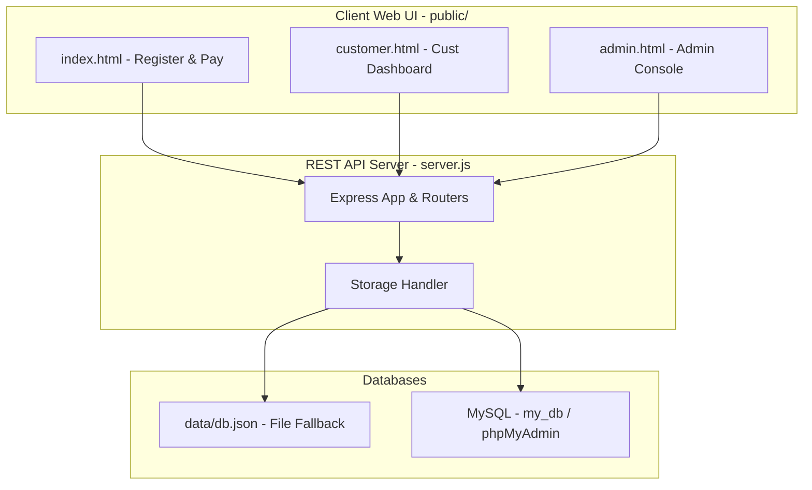

# Aqualine Water Billing System - Project Analysis

Aqualine Water Billing System is a Node.js/Express-based web application designed for token-based water billing. It includes customer registration, automated or simulated MPESA STK push payments, manual payment reconciliation, token generation, SMS notification delivery, and an admin console with an internal treasury and settlement ledger.

---

## 1. Project Directory Structure

```text
├── server.js               # Main Express server and application entry point
├── package.json            # Node.js project dependencies and run scripts
├── .env.example            # Template for environment configuration variables
├── data/
│   ├── db.json             # Local database (ignored by Git, dynamically populated)
│   └── db.seed.json        # Base database template structure
├── docs/
│   └── screenshots/        # Assets folder for documentation images
├── public/
│   ├── index.html          # Main customer registration and payment portal page
│   ├── customer.html       # Customer secure dashboard login and history portal
│   ├── admin.html          # Protected administrator console panel
│   ├── styles.css          # Shared visual presentation and layout styles
│   ├── app-config.js       # Global dynamic API endpoints configurations
│   ├── customer.js         # JavaScript handler for portal-to-server interactions
│   ├── customer-portal.js  # JavaScript handler for active customer dashboard
│   └── admin.js            # JavaScript logic for administrative operations
└── schema/
    └── my_db.sql           # Schema definition file for MySQL migrations
```

---

## 2. System Architecture

The application has a decoupled architecture where the backend functions as a REST API and the frontend is composed of simple static HTML, CSS, and Vanilla JavaScript assets (enhanced by Tailwind CSS).



### Storage Engines
The application dynamically selects its storage engine based on configuration:
1. **MySQL Mode**: Activated when environment variables `MYSQL_URL` or `MYSQL_USER` and `MYSQL_DATABASE` are defined. Database state is updated in transactions and synchronized with the internal database cache.
2. **JSON File Mode**: The default fallback. State is maintained inside memory (`dbCache`) and persisted locally to `data/db.json` asynchronously with a debounced timer.

---

## 3. Data Models & Entities

The system maintains 5 core collections of data, shared by both JSON schema and MySQL tables:

### 1. Customers (`awbc_customers`)
Stores customer details and authentication state.
- `id` (UUID): Primary key.
- `fullName`: Used for identification and login check.
- `phone`: Cleaned telephone number (unique key).
- `loginCode` / `loginToken`: Tokens used for session access.
- `createdAt` / `updatedAt` / `lastActivityAt`: Lifecycle timestamps.

### 2. Payments (`awbc_payments`)
Tracks payment attempts, manual reviews, and token generation.
- `id` (UUID): Primary key.
- `customerId`: Foreign key link to customer.
- `phone` / `amount`: Payment metrics.
- `unitType`: Choice of plan (`litre` vs. `1000_litre`).
- `status`: Lifecycle state (`pending`, `paid`, `failed`, `pending_manual`, `rejected_manual`).
- `paymentChannel`: Payment mechanism (`mpesa_stk` or `manual_till`).
- `checkoutRequestId` / `merchantRequestId`: Safe tracking keys for live Daraja.
- `mpesaReceipt` / `mpesaReceiptSubmitted`: Live or client-declared MPESA confirmation keys.
- `tokenCode`: 9-digit water tokens generated for successful transactions.
- `litresBought`: calculated floor division value.
- `refundedAmount` / `refundStatus`: Partial or full refund trackers.
- `sms`: JSON record logs of notification provider responses.

### 3. Settlements (`awbc_settlements`)
Tracks internal allocations of confirmed payment amounts.
- `id` (UUID): Primary key.
- `paymentId`: The source payment record.
- `customerId`: Customer who initiated the transaction.
- `totalAmount`: The original payment amount.
- `savingsAmount` / `operationsAmount`: Computed division based on policy.
- `status`: Settlement status (`settled`).

### 4. Refunds (`awbc_refunds`)
Tracks maker-checker refund requests and execution records.
- `id` (UUID): Primary key.
- `paymentId` / `customerId`: Reference to payment.
- `amount`: Refund request value.
- `reason`: Explanation.
- `status`: `pending_approval` or `approved`.
- `requestedBy` / `approvedBy`: Tracks creators and approvers (maker-checker validation).
- `approvedAt` / `issuedRefundId`: Processing markers.

### 5. Ledger (`awbc_ledger_entries`)
Immutable accounting record containing double-entry trace.
- `id` (UUID): Primary key.
- `type`: Category (`opening_balance`, `payment_confirmed`, `settlement_transfer`, `float_topup`, `refund_requested`, `refund_issued`, `auto_settlement_sweep`).
- `amount`: Monetary value.
- `direction`: Direction of currency movement (`in` or `out`).
- `account`: Target internal balance sheet (`collections`, `operations`, `savings`).
- `referenceId`: Identifier linking to source payments, settlements, or refunds.
- `note`: Accounting annotation text.
- `metadata`: JSON object containing contextual IDs.

---

## 4. Key Business Logic & Flows

### A. MPESA Payment (Direct & Simulation Mode)
1. Customer initiates payment via `POST /api/payments/mpesa`.
2. **Simulation Mode**: If API credentials for MPESA (Daraja) are missing, the system instantly sets payment status to `paid` and generates a token code.
3. **Live Mode**: Initiates a Daraja STK Push request to Safaricom's sandbox or production API. The payment is created with a `pending` status. Once Safaricom calls `/api/payments/mpesa/callback` with a successful receipt code, the payment is finalized, token code is generated, and SMS notification is triggered.

### B. Manual Receipt Submission & Reconcile
1. If MPESA integration is inactive or failing, customers can pay using a temporary merchant Till and manually submit the receipt code via `/api/payments/manual-submit`.
2. The payment record enters `pending_manual` state.
3. An admin can review and call `POST /api/admin/payments/:paymentId/manual-approve` or `manual-reject` to approve or discard the request.

### C. Water Pricing & Token Generation
- **Litres purchased** are calculated during settlement:
  - `litre` billing mode: `1 litre = KES 10`
  - `1000_litre` billing mode: `1000 litres = KES 10,000`
- Floor division is used. Buying less than the package cost returns an error.
- A 9-digit numerical token is generated as a secure random code.

### D. Settlement Policy & Sweep
Incoming confirmed payments go through a split allocation:
- **Default Policy**: `70%` goes to the `savings` balance, and the remaining `30%` goes to `operations` balance.
- **Auto-settlement sweep**: An hourly background loop checks `AUTO_SETTLEMENT_HOUR_UTC` (default 1 AM). If any paid payment lacks a `settlementId`, it executes settlement distribution to avoid accounting omissions.

### E. Maker-Checker Refund Workflow
To prevent internal fraud, refunds are protected under Maker-Checker conditions:
1. An administrator creates a refund request via `POST /api/admin/refunds` (`pending_approval`).
2. A separate auditor/approver checks and issues confirmation via `POST /api/admin/refunds/:refundId/approve` using their `x-approver-key`.
3. The requester and the approver **must not be the same actor**.
4. The refund is paid out exclusively from the `operations` balance pool. If the operations float is too low, the admin must top it up from collections first.

---

## 5. Main API Routes

| Endpoint | Method | Role | Protection |
| :--- | :--- | :--- | :--- |
| `/api/pricing` | `GET` | Retrieve pricing configuration | Public |
| `/api/payment-instructions` | `GET` | Read manual pay instructions | Public |
| `/api/customers/register` | `POST` | Register or update customer details | Public |
| `/api/payments/mpesa` | `POST` | Process immediate STK payment or simulation | Public |
| `/api/payments/manual-submit` | `POST` | Submit manual receipt for admin verification | Public |
| `/api/payments/mpesa/callback` | `POST` | Safaricom STK Push callback listener | Public |
| `/api/customer/login` | `POST` | Authenticate customer | Public |
| `/api/customer/me` | `GET` | Fetch login user transactions & metadata | Customer Token |
| `/api/admin/auth-check` | `GET` | Verify admin credentials | Admin Key |
| `/api/admin/integration-status`| `GET` | View Live/Simulated status configurations | Admin Key |
| `/api/admin/payments/recent` | `GET` | Fetch historical list of all payments | Admin Key |
| `/api/admin/payments/pending-manual`| `GET`| List manual review pending requests | Admin Key |
| `/api/admin/payments/:id/manual-approve`| `POST` | Approve pending receipt and release token | Admin Key |
| `/api/admin/payments/:id/manual-reject`| `POST` | Reject a fake/duplicate manual receipt | Admin Key |
| `/api/admin/finance/overview` | `GET` | Fetch treasury balances & policy stats | Admin Key |
| `/api/admin/finance/ledger` | `GET` | Retrieve list of immutable ledger entries | Admin Key |
| `/api/admin/finance/top-up-operations`| `POST`| Transfer from collections to operations float | Admin Key |
| `/api/admin/finance/settle-unsettled-payments`| `POST`| Trigger manual run of the settlement split | Admin Key |
| `/api/admin/refunds` | `POST` | Create a refund request | Admin Key |
| `/api/admin/refunds/pending` | `GET` | List pending refunds for checker review | Admin Key |
| `/api/admin/refunds/:id/approve`| `POST` | Approve & issue refund | Approver Key |
| `/api/admin/customers` | `GET` | Fetch customer directory + aggregate stats | Admin Key |
| `/api/admin/customers/report` | `GET` | Download customer ledger directory as CSV | Admin Key |
| `/api/admin/customers/inactive` | `DELETE`| Prune customer accounts inactive for N years | Admin Key |
